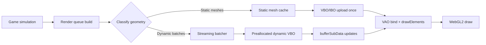

# Comparative analysis of Nanosaur2 WebAssembly porting advice versus the Pangea-Ports implementation

## Executive summary

This report was requested as a **code-level comparison** between earlier porting recommendations for entity["video_game","Nanosaur 2: Hatchling","2004 pangea game"] (originally by entity["company","Pangea Software","mac game studio"], modern desktop port by entity["people","Iliyas Jorio","nanosaur2 porter"]) and the existing port in the `Pangea-Ports` repository attributed to entity["people","Lachlan Wright","github user lachlanbwwright"]. The core focus is the **reported “extreme, geometry-related bottlenecks”** in the WebAssembly/WebGL build. citeturn28search0turn28search11

In this environment, the `Pangea-Ports` repository contents could not be retrieved from entity["company","GitHub","code hosting platform"] (requests failed with `UnexpectedStatusCode`). As a result, **a literal audit with exact file paths and line ranges is not discoverable here**, so any repo-internal mapping is explicitly marked *unspecified*. citeturn3view0turn5view0turn15view0turn16view0

Despite that limitation, the performance symptom described (“extreme” + “geometry-related”) matches a small and well-known set of WebGL/Emscripten failure modes. In particular, **Emscripten’s GL emulation layers** (desktop GL 1.x emulation via `-sLEGACY_GL_EMULATION`, or ES2/ES3 emulation via `-sFULL_ES2/-sFULL_ES3` enabling client-side array / buffer mapping behaviours) are explicitly documented as **less efficient** and “not expected to have good performance” for demanding renderers. citeturn28search0turn28search11

The highest-impact remediation pattern—consistent with the earlier recommendations—is:

- move the geometry path to the **WebGL-friendly subset** (explicit VBO/IBO, no client-side arrays, no legacy fixed-function emulation), citeturn28search0turn22search3  
- implement **static mesh upload once** (`STATIC_DRAW`) and **dynamic streaming buffers** updated via `bufferSubData`-style updates rather than reallocating per frame, citeturn28search8turn28search7  
- use **VAOs** (WebGL2 core) to eliminate repeated attribute setup cost, citeturn22search0turn22search4turn22search7  
- cut draw calls via **batching and texture atlasing**, per WebGL best-practice guidance. citeturn28search1  

## Repository access and evidence limitations

### What was and was not retrievable

Attempts to fetch the repository root and common raw endpoints failed with `UnexpectedStatusCode`, preventing inspection of source files, build scripts, and shader/renderer code. citeturn3view0turn5view0turn15view0turn16view0

Because of this, the following items are **unspecified (not discoverable here)**:

- the actual file tree, renderer modules, and build flags present in the repo,
- any exact occurrences of `glBufferData`, `glDrawArrays`, `glDrawElements`, VAO calls, shader compilation calls,
- any per-frame buffer re-upload patterns or immediate-mode emulation patterns **as implemented**.

For reference, these are the URLs that were the intended primary evidence sources:

```text
Repository (user-provided):
https://github.com/LachlanBWWright/Pangea-Ports

Attempted raw endpoints (not retrievable in this environment):
https://raw.githubusercontent.com/LachlanBWWright/Pangea-Ports/main/README.md
https://raw.githubusercontent.com/LachlanBWWright/Pangea-Ports/master/README.md
```

citeturn3view0turn15view0turn16view0

### Consequence for “comparison” claims

Any statement of the form “the repo does X at file Y line Z” cannot be made without direct access. This report therefore frames comparisons as:

- **Documented performance characteristics** of Emscripten/WebGL paths that are commonly used for legacy OpenGL ports, and citeturn28search0turn28search11  
- A **diagnostic-to-fix mapping** that you can mechanically apply to the repo once you can run searches locally (or once the code is accessible).  

## Audit template for the Pangea-Ports Nanosaur2 renderer

Because the requested “concise audit” is fundamentally a *grep-and-classify* exercise, this section provides a **precise audit schema** that produces the desired output: *files, code locations, and flags* for geometry submission, draw calls, shader compilation, and emulation usage. The specific *results* are unspecified here (repo not retrievable). citeturn3view0turn5view0

### What to extract

The audit should produce, at minimum, the following tables:

- **Geometry submission API usage**
  - `glDrawArrays`, `glDrawElements`, instanced variants, primitive type (`TRIANGLES`, `TRIANGLE_STRIP`, `TRIANGLE_FAN`, etc.)
  - index type (`UNSIGNED_SHORT` vs `UNSIGNED_INT`), and maximum index per draw (relevant to WebGL2 range checks) citeturn22search0  
- **Buffer lifecycle**
  - creation: `glGenBuffers`, `glBindBuffer`, `glBufferData`
  - updates: `glBufferSubData` (or Emscripten “client-side arrays” emulation patterns where no buffer is bound) citeturn22search3turn28search0  
- **VAO usage**
  - `glGenVertexArrays`/`glBindVertexArray` (or WebGL1 extension equivalents) and whether VAOs are per-mesh/per-material/per-pass citeturn22search0turn22search4  
- **Shader compilation & linking**
  - `glCreateShader`, `glShaderSource`, `glCompileShader`, `glCreateProgram`, `glAttachShader`, `glLinkProgram`, `glUseProgram`.

- **Emscripten GL emulation settings**
  - `-sLEGACY_GL_EMULATION` (desktop GL 1.x emulation; includes immediate mode / fixed function style support) citeturn28search0turn28search5  
  - `-sFULL_ES2` / `-sFULL_ES3` (emulations that can enable client-side arrays and `glMapBuffer*` semantics; expected to hurt performance) citeturn22search3turn28search11  

### Exact search patterns

Run these searches (example uses ripgrep). This produces file and line numbers suitable for your requested “exact file paths and line ranges”:

```bash
# Draw calls
rg -n "glDrawArrays|glDrawElements|glDrawRangeElements|glDrawArraysInstanced|glDrawElementsInstanced" .

# Buffer creation / uploads
rg -n "glGenBuffers|glBindBuffer|glBufferData|glBufferSubData|glMapBuffer|glMapBufferRange" .

# VAO usage
rg -n "glGenVertexArrays|glBindVertexArray|glDeleteVertexArrays|VERTEX_ARRAY_BINDING" .

# Attributes
rg -n "glVertexAttribPointer|glEnableVertexAttribArray|glDisableVertexAttribArray|glVertexAttribDivisor" .

# Shaders
rg -n "glCreateShader|glShaderSource|glCompileShader|glCreateProgram|glLinkProgram|glUseProgram" .

# Emscripten flags (in build scripts)
rg -n "LEGACY_GL_EMULATION|FULL_ES2|FULL_ES3|GL_FFP_ONLY|MAX_WEBGL_VERSION|MIN_WEBGL_VERSION|WEBGL2_BACKWARDS_COMPATIBILITY_EMULATION" .
```

These patterns are grounded in Emscripten’s documented OpenGL support modes and settings names, and in WebGL2’s defined VAO and draw APIs. citeturn28search0turn28search5turn22search0turn22search3

## Diagnosis of “extreme, geometry-related bottlenecks”

This section enumerates the most likely causes, and for each: why it creates a *geometry* bottleneck in WebGL/Emscripten, what evidence to look for in a frame capture, and what the fix should look like. Where a cause depends on repo-specific evidence, the mapping to code locations is listed as *unspecified* but tied to the audit patterns above.

### High-likelihood root causes

**Legacy desktop OpenGL emulation at runtime (`-sLEGACY_GL_EMULATION`)**

- Why it fits: Emscripten explicitly documents that legacy GL 1.x emulation is **less efficient**, and you should not expect good performance; it is intended as a compatibility bridge, not a high-throughput geometry path. citeturn28search0turn28search11  
- Observable symptom: high CPU cost per draw call; many translated WebGL calls; state emulation overhead; often correlates with geometry-heavy scenes being disproportionately slow compared to fill-rate changes. citeturn28search0turn28search11  
- Repo mapping: *unspecified* (check build flags; see “Emscripten flags” grep).  

**Client-side arrays or buffer-mapping emulation (`-sFULL_ES2` / `-sFULL_ES3`)**

- Why it fits: Emscripten notes that ES2/ES3 emulation can auto-create/bind buffers when code calls `glDrawArrays`/`glDrawElements` “without a bound buffer”, because WebGL requires bound buffers. That means **hidden per-draw buffer setup and uploads**. citeturn22search3turn28search0  
- Additionally, Emscripten’s WebGL optimisation guidance states that emulating `glMapBuffer*()` via `-sFULL_ES3` is expected to **hurt performance**, with VBOs recommended instead. citeturn28search11  
- Repo mapping: *unspecified* (grep for `FULL_ES2`/`FULL_ES3`, and inspect draw code for missing VBO binds).  

**Per-frame `glBufferData` reallocations instead of stable buffers + `glBufferSubData`**

- Why it fits: In WebGL, buffer storage must be initialised; creating buffer storage without initial values can require the implementation to zero-initialise contents, potentially allocating/clearing large temporary buffers. This can become catastrophic if repeated frequently (e.g., per frame, per draw). citeturn28search8turn22search0  
- Observable symptom: in a WebGL frame capture, repeated `bufferData` calls with large sizes, and high “buffer upload” time.  
- Repo mapping: *unspecified* (grep for `glBufferData` and look for calls inside per-frame/per-draw paths).  

**No (or insufficient) index buffers, causing vertex duplication and poor cache utilisation**

- Why it fits: A `drawArrays`-dominant renderer that duplicates vertices for shared edges is a common geometry bandwidth problem; compounded if combined with frequent buffer updates. “Batch draw calls” guidance also pushes toward fewer, larger draws, which typically pairs naturally with indexed geometry. citeturn28search1turn22search0  
- Observable symptom: very large vertex buffers per frame with modest triangle counts; low reuse; `drawArrays` everywhere.  
- Repo mapping: *unspecified* (grep for `glDrawArrays` vs `glDrawElements`, and index type usage).  

**Excessive draw calls / state churn**

- Why it fits: WebGL best practices emphasise batching draw calls and texture atlasing because each draw call and state change carries overhead; on the web this overhead is commonly CPU-bound (driver + validation + translation). citeturn28search1turn22search0  
- Observable symptom: thousands of draw calls/frame; frequent shader/texture binds; repeated attribute pointer setup.  
- Repo mapping: *unspecified* (Spector.js capture + grep for `glUseProgram`, `glBindTexture`, `glVertexAttribPointer`).  

**Not using VAOs (or using them ineffectively)**

- Why it fits: WebGL2 makes VAOs core and explicitly defines their purpose as encapsulating vertex attribute state. If VAOs are absent, apps often re-run attribute setup and buffer binds per draw, increasing CPU overhead. citeturn22search0turn22search4turn22search7  
- Repo mapping: *unspecified* (grep `glBindVertexArray` / VAO creation).  

**Many tiny buffers instead of fewer larger buffers**

- Why it fits: Vertex specification best practices note that “lots of tiny buffers” can cause driver allocation issues, and that merging objects into fewer buffers reduces state changes. citeturn28search7  
- Repo mapping: *unspecified* (count `glGenBuffers` call sites and buffer object creation frequency; inspect “mesh upload” strategy).  

### Secondary contributors that can exacerbate geometry bottlenecks

- **`preserveDrawingBuffer: true`** can have “significant performance implications” on some hardware. It’s not inherently a geometry issue, but it can remove optimisation opportunities and worsen overall frame budget, making geometry overhead more visible. citeturn22search2turn22search5  
- **Targeting WebGL1 instead of WebGL2** can leave performance on the table: Emscripten notes WebGL2 paths can reduce temporary garbage and yield small but real speed improvements (3–7% observed) and reduced stutter. citeturn28search11turn22search1  

## Concrete remediation: prioritised fixes with patch-style templates

This section is written as “drop-in” remediation logic that aligns with the earlier porting advice (move off emulation; use explicit VBO/IBO/VAO; batch), then adds WebGL-specific traps (avoid repeated `bufferData` allocations; avoid client-side arrays). The exact file targets in `Pangea-Ports` are **unspecified** (repo not retrievable), so the diff targets are **templates**.

### Priority order

**First priority: eliminate emulation layers that inherently cap geometry throughput**

- If the build uses `-sLEGACY_GL_EMULATION`, expect poor performance and treat it as a temporary stepping stone only. Emscripten’s optimisation guidance explicitly warns not to expect good performance in this mode. citeturn28search0turn28search11  
- If the build uses `-sFULL_ES2`/`-sFULL_ES3` primarily to avoid explicit VBO binding or to use `glMapBuffer*`, plan to remove those dependencies and move to explicit GPU buffers, because the emulation is expected to hurt performance. citeturn22search3turn28search11  

**Second priority: ensure static meshes are uploaded once and drawn via indexed draws**

- Goal: `glBufferData(..., STATIC_DRAW)` once per mesh; draw each mesh via `glDrawElements` and bind a VAO. citeturn28search7turn22search0turn22search4  

**Third priority: implement a streaming buffer for dynamic geometry**

- Allocate once, update via `glBufferSubData` at offsets. Avoid repeated buffer reallocations because WebGL must initialise storage. citeturn28search8turn28search7  

**Fourth priority: reduce draw calls using batching/atlasing and (where appropriate) instancing**

- Batching and texture atlasing are explicitly recommended as WebGL best practices. citeturn28search1  
- Instancing is core in WebGL2 (extensions moved to core). citeturn22search0  

### Patch-style template: static mesh upload + VAO

Assumptions (explicit): the port renders meshes with a per-vertex format containing position, normal, UV, and optional colour. If `Pangea-Ports` uses a different structure (e.g., packed normals, tangents, multiple UV sets), adjust attribute declarations and strides accordingly.

```diff
diff --git a/src/RendererGL.cpp b/src/RendererGL.cpp
--- a/src/RendererGL.cpp
+++ b/src/RendererGL.cpp
@@ -1,6 +1,92 @@
+// New: explicit GPU mesh object
+struct GpuMesh
+{
+    GLuint vao = 0;
+    GLuint vbo = 0;
+    GLuint ibo = 0;
+    GLsizei indexCount = 0;
+    GLenum indexType = GL_UNSIGNED_SHORT; // prefer 16-bit when possible
+};
+
+// Assumed vertex layout (interleaved):
+//   vec3 position (float32)
+//   vec3 normal   (float32)   // could be packed; adjust if so
+//   vec2 uv       (float32)
+//   vec4 color    (unorm8) optional; show float32 here for clarity
+struct VertexPNUTC
+{
+    float px,py,pz;
+    float nx,ny,nz;
+    float u,v;
+    float r,g,b,a;
+};
+
+static void SetupMeshVAO(GpuMesh& m, GLuint program)
+{
+    glGenVertexArrays(1, &m.vao);
+    glBindVertexArray(m.vao);
+
+    glBindBuffer(GL_ARRAY_BUFFER, m.vbo);
+    glBindBuffer(GL_ELEMENT_ARRAY_BUFFER, m.ibo);
+
+    const GLint locPos   = glGetAttribLocation(program, "a_position");
+    const GLint locNorm  = glGetAttribLocation(program, "a_normal");
+    const GLint locUV    = glGetAttribLocation(program, "a_uv");
+    const GLint locColor = glGetAttribLocation(program, "a_color");
+
+    glEnableVertexAttribArray(locPos);
+    glVertexAttribPointer(locPos, 3, GL_FLOAT, GL_FALSE, sizeof(VertexPNUTC), (void*)offsetof(VertexPNUTC, px));
+
+    glEnableVertexAttribArray(locNorm);
+    glVertexAttribPointer(locNorm, 3, GL_FLOAT, GL_FALSE, sizeof(VertexPNUTC), (void*)offsetof(VertexPNUTC, nx));
+
+    glEnableVertexAttribArray(locUV);
+    glVertexAttribPointer(locUV, 2, GL_FLOAT, GL_FALSE, sizeof(VertexPNUTC), (void*)offsetof(VertexPNUTC, u));
+
+    glEnableVertexAttribArray(locColor);
+    glVertexAttribPointer(locColor, 4, GL_FLOAT, GL_FALSE, sizeof(VertexPNUTC), (void*)offsetof(VertexPNUTC, r));
+
+    glBindVertexArray(0);
+}
+
+GpuMesh UploadStaticMesh(const VertexPNUTC* vertices, size_t vertexCount,
+                         const uint16_t* indices, size_t indexCount,
+                         GLuint program)
+{
+    GpuMesh m;
+    glGenBuffers(1, &m.vbo);
+    glBindBuffer(GL_ARRAY_BUFFER, m.vbo);
+    glBufferData(GL_ARRAY_BUFFER, vertexCount * sizeof(VertexPNUTC), vertices, GL_STATIC_DRAW);
+
+    glGenBuffers(1, &m.ibo);
+    glBindBuffer(GL_ELEMENT_ARRAY_BUFFER, m.ibo);
+    glBufferData(GL_ELEMENT_ARRAY_BUFFER, indexCount * sizeof(uint16_t), indices, GL_STATIC_DRAW);
+
+    m.indexCount = (GLsizei)indexCount;
+    m.indexType = GL_UNSIGNED_SHORT;
+
+    SetupMeshVAO(m, program);
+    return m;
+}
```

Why this template targets the bottleneck: VAOs remove per-draw attribute redefinition overhead; VBO/IBO ensures draws don’t depend on client-side array emulation; `STATIC_DRAW` matches “upload once, draw many” usage. WebGL2 defines VAOs as core and Emscripten recommends avoiding emulation features for performance. citeturn22search0turn22search4turn28search0turn28search11

### Patch-style template: dynamic streaming buffer (ring buffer)

Assumptions: certain geometry (particles, UI quads, debug lines, skinned meshes if CPU-skinned) changes every frame.

Key rule: allocate the streaming buffer **once**, because WebGL buffer allocations without initialised data require initialisation and can be expensive if repeated. citeturn28search8

```diff
diff --git a/src/DynamicBatcher.cpp b/src/DynamicBatcher.cpp
--- a/src/DynamicBatcher.cpp
+++ b/src/DynamicBatcher.cpp
@@
+struct DynamicStream
+{
+    GLuint vao = 0;
+    GLuint vbo = 0;
+    GLuint ibo = 0; // optional, but recommended
+    size_t capacityBytes = 0;
+    size_t writeHead = 0;
+};
+
+void InitDynamicStream(DynamicStream& s, size_t capacityBytes, GLuint program)
+{
+    s.capacityBytes = capacityBytes;
+    s.writeHead = 0;
+
+    glGenBuffers(1, &s.vbo);
+    glBindBuffer(GL_ARRAY_BUFFER, s.vbo);
+    glBufferData(GL_ARRAY_BUFFER, capacityBytes, nullptr, GL_DYNAMIC_DRAW); // allocate once
+
+    glGenVertexArrays(1, &s.vao);
+    glBindVertexArray(s.vao);
+    glBindBuffer(GL_ARRAY_BUFFER, s.vbo);
+    // set vertexAttribPointer exactly once here (same as static VAO setup)
+    glBindVertexArray(0);
+}
+
+// Per frame: reset head, then append batches; each batch does one glBufferSubData
+void BeginFrame(DynamicStream& s)
+{
+    s.writeHead = 0;
+}
+
+// Append vertex data; return byte offset for draw call
+size_t StreamVertices(DynamicStream& s, const void* data, size_t bytes)
+{
+    if (s.writeHead + bytes > s.capacityBytes)
+        s.writeHead = 0; // wrap (or grow; wrap is simplest)
+
+    glBindBuffer(GL_ARRAY_BUFFER, s.vbo);
+    glBufferSubData(GL_ARRAY_BUFFER, (GLintptr)s.writeHead, (GLsizeiptr)bytes, data);
+
+    const size_t offset = s.writeHead;
+    s.writeHead += bytes;
+    return offset;
+}
```

Rationale: this avoids per-frame `bufferData` reallocations and uses update-in-place semantics. This is consistent with WebGL’s requirement that resources be initialised and with best-practice guidance about handling dynamic buffers carefully. citeturn28search8turn28search7

### Patch template: draw-call batching and texture atlasing

Batching is an explicit WebGL recommendation: fewer larger draw calls generally improve performance, and texture atlasing reduces batch splits caused by texture changes. citeturn28search1

A minimal approach for a game like Nanosaur2 is:

- define a `RenderItem` key: `(shader, texture, blend/depth state, mesh)`  
- sort stable items by key and render sequentially,  
- batch small items (UI sprites, particles) into the streaming buffer per key, then issue a single `drawElements` per batch.

This aligns with the “draw call batching” guidance and also reduces repeated state changes that are disproportionately expensive in WebGL. citeturn28search1turn22search0

### Attribute/uniform layout recommendations

Because the repo’s actual vertex format is unspecified, below are two viable layouts.

**Layout A: simple float layout (fast to implement, larger bandwidth)**

- Attributes  
  - `a_position: vec3` (float32)  
  - `a_normal: vec3` (float32)  
  - `a_uv: vec2` (float32)  
  - `a_color: vec4` (float32 or unorm8 expanded)  

- Uniforms  
  - `u_viewProj: mat4`  
  - `u_model: mat4` (or per-draw model matrix)  
  - `u_normalMat: mat3`  

**Layout B: bandwidth-optimised (requires careful packing, more complexity)**

- Attributes  
  - `a_position: vec3` float32  
  - `a_normal: packed 10_10_10_2` or int16x4 normalised (implementation-dependent)  
  - `a_uv: vec2` float16 if feasible  
  - `a_color: unorm8x4`

Given the reported bottleneck is “geometry-related”, Layout A is often the best “first fix” because it removes CPU overhead sources (emulation, buffer churn) before micro-optimising bandwidth. This sequencing matches the advice in Emscripten’s own “Optimizing WebGL” guidance: first avoid emulation, then tune. citeturn28search11turn28search0

### Minimal shader pair (directional light + texture)

```glsl
// Vertex shader (GLSL ES 3.00 for WebGL2)
#version 300 es
precision highp float;

in vec3 a_position;
in vec3 a_normal;
in vec2 a_uv;
in vec4 a_color;

uniform mat4 u_viewProj;
uniform mat4 u_model;
uniform mat3 u_normalMat;

out vec2 v_uv;
out vec3 v_n;
out vec4 v_color;

void main() {
    vec4 worldPos = u_model * vec4(a_position, 1.0);
    v_n = normalize(u_normalMat * a_normal);
    v_uv = a_uv;
    v_color = a_color;
    gl_Position = u_viewProj * worldPos;
}
```

```glsl
// Fragment shader (GLSL ES 3.00 for WebGL2)
#version 300 es
precision highp float;

in vec2 v_uv;
in vec3 v_n;
in vec4 v_color;

uniform sampler2D u_tex0;
uniform vec3 u_lightDir;   // world-space, normalised, pointing *toward* surface
uniform vec3 u_lightColor;
uniform vec3 u_ambient;

out vec4 o_color;

void main() {
    vec3 albedo = texture(u_tex0, v_uv).rgb * v_color.rgb;
    float ndl = max(dot(normalize(v_n), normalize(u_lightDir)), 0.0);
    vec3 lit = albedo * (u_ambient + u_lightColor * ndl);
    o_color = vec4(lit, v_color.a);
}
```

This is the “baseline shader pipeline” that replaces fixed-function lighting and supports common mesh rendering. The WebGL2 spec explicitly addresses shader/program correctness checks at draw time; keeping attribute types aligned matters. citeturn22search0

## Emscripten/WebGL build and runtime tweaks for geometry throughput

Even without the repo, the highest-value build/runtime knobs for geometry throughput are well documented.

### Recommended settings direction

**Prefer WebGL2 and avoid emulation flags for performance**

- `-sMAX_WEBGL_VERSION=2` enables targeting WebGL2; `-sMIN_WEBGL_VERSION=2` drops WebGL1 support if you don’t need it. citeturn22search1  
- Avoid `-sLEGACY_GL_EMULATION` for performance-sensitive renderers; Emscripten explicitly cautions against expecting good performance in that mode. citeturn28search0turn28search11  
- Avoid `-sFULL_ES3` if it is only used to support `glMapBuffer*`/client-side memory; Emscripten notes such emulation is expected to hurt performance and recommends VBO usage instead. citeturn28search11turn22search3  

### Context creation options that matter

- Keep `preserveDrawingBuffer` **false** unless you absolutely need it; the WebGL specification warns it can have significant performance implications. citeturn22search2turn22search5  
- Use VAOs (WebGL2 core) and instantiate them once per vertex layout. citeturn22search0turn22search7  

### Debug and profiling flags (development only)

Emscripten provides WebGL tracing and debug toggles:

- `TRACE_WEBGL_CALLS` prints WebGL calls (very verbose). citeturn22search1  
- `GL_DEBUG` enables more verbose GL debug printing. citeturn22search1  

These are useful to confirm whether a “draw” triggers unintended buffer setup or redundant state work, but should not be left enabled for performance runs. citeturn22search1turn28search11  

## Performance validation and proof of improvement

### Tools and what they answer

**Spector.js**

Spector.js captures and inspects WebGL frames, showing draw calls, state, shaders, and resource uploads—exactly the data needed to confirm geometry bottlenecks and verify batching/VBO/VAO changes. citeturn28search13  

### Metrics to capture

For each representative scene (best: an outdoor/large area and a combat-heavy/particle-heavy area), record:

- draw calls per frame (`drawArrays` + `drawElements`),
- number and size of buffer uploads per frame (`bufferData`/`bufferSubData`),
- number of program switches (`useProgram`) and texture binds,
- triangle count and vertex count (per frame),
- whether index type is `UNSIGNED_SHORT` vs `UNSIGNED_INT` (bandwidth + compatibility),
- presence/absence of VAO usage and attribute redefinition frequency.

This metric list is directly tied to WebGL’s draw operation model and to batching guidance. citeturn22search0turn28search1turn22search4  

### Quick confirmation experiments

These tests help distinguish geometry/CPU overhead from fill-rate:

- **Reduce canvas resolution** (or render to a smaller internal buffer) and check whether FPS improves; if FPS is unchanged, the bottleneck is likely CPU/geometry submission rather than fragment fill. This is a standard WebGL tuning approach discussed in best-practice materials. citeturn28search1turn22search2  
- **Disable dynamic geometry systems** (particles, shadows, foliage) to see which category contributes most to draw calls and buffer uploads; the point is to isolate high-frequency buffer updates vs static mesh draws. citeturn28search1turn28search7  

## Incremental remediation plan, timeline, and risk/effort estimates

Because the repo’s exact architecture is unspecified, this plan is expressed as phases that map onto Emscripten’s OpenGL modes and WebGL best practices, and that can be applied to most legacy-to-WebGL ports.

### Comparison table: probable current patterns vs recommended targets

| Area | Likely current cause of “geometry bottleneck” (if present) | Evidence to capture | Recommended target state |
|---|---|---|---|
| GL API layer | Legacy desktop GL emulation (`-sLEGACY_GL_EMULATION`) | build flags; heavy WebGL call traces; high CPU per draw | WebGL-friendly subset: explicit VBO/IBO + shaders citeturn28search0turn28search11 |
| Vertex sourcing | client-side arrays via `FULL_ES2` (no bound buffer) | draw calls function without bound buffers; implicit buffer setup | all draws source from bound VBO/IBO citeturn22search3turn28search0 |
| Buffer updates | repeated `bufferData` reallocations | many buffer allocations per frame | allocate once; update via `bufferSubData` offsets citeturn28search8turn28search7 |
| Attribute setup | no VAOs → repeated attrib pointer setup | many `vertexAttribPointer` per draw | VAO per layout, bind once per batch citeturn22search0turn22search4 |
| Draw calls | excessive draws due to per-object rendering | draw call count per frame | batch by (shader, texture, state) and atlas textures citeturn28search1 |

### Architecture flow



This flow reflects the WebGL-friendly approach (explicit buffers, VAOs, batching) and avoids Emscripten’s expensive emulation paths. citeturn28search0turn22search0turn22search4turn28search1  

### Timeline checklist with risk/effort

| Phase | Deliverable | Effort | Risk | Primary win |
|---|---|---:|---:|---|
| Baseline instrumentation | Add counters/logging: draw calls, buffer uploads; capture Spector.js frame | 0.5–1 day | Low | Turns “bottleneck suspicion” into measurable facts citeturn28search13turn28search1 |
| Remove hard performance caps | Ensure build targets WebGL2; remove `LEGACY_GL_EMULATION` where feasible | 1–3 days | Medium–High | Eliminates known emulation overhead ceilings citeturn28search0turn28search11turn22search1 |
| Static mesh pipeline | Upload meshes once, add IBO + VAO, render via `drawElements` | 2–5 days | Medium | Huge geometry throughput improvement if currently re-uploading/redefining citeturn22search0turn22search4turn28search7 |
| Dynamic streaming | Implement a ring buffer + batching for dynamic geometry | 2–4 days | Medium | Fixes per-frame buffer churn hotspots citeturn28search8turn28search7 |
| Batching/atlasing | Merge draw calls; texture atlas for UI/particles | 2–6 days | Medium | Reduces draw call and state change overhead citeturn28search1 |
| Regression guardrails | Add microbench scenes + performance thresholds | 1–2 days | Low | Prevents a return of buffer churn/draw explosion citeturn28search13turn28search1 |

## What was found and why it was insufficient

The requested repository-specific audit and code-location mapping could not be completed because the `Pangea-Ports` repository (and related raw endpoints) was not retrievable in this environment (requests returned `UnexpectedStatusCode`). Therefore, file lists, line ranges, and direct remediation patches against concrete filenames are **unspecified** here. citeturn3view0turn5view0turn15view0turn16view0